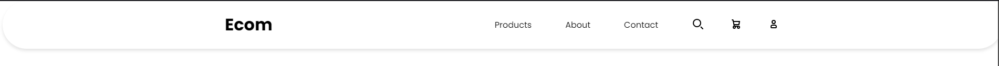
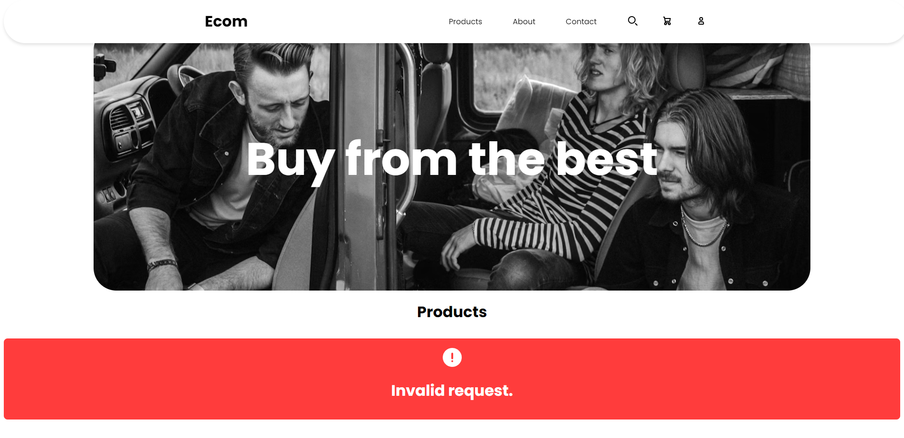

# React E-commerce Product List Application 

This is a simple React e-commerce product list application that displays products that is received from the API. Additional Details of a product can be viewed through a modal, and includes a counter component for entering product quantities.

## Implementation

-Fetches and displays data from a mock API. The Mock API used here is [fakeapistore.com](https://fakestoreapi.com). It provides various features and provided the necessary data for a mock ecommerce application 

-It includes a header component that includes the application's name and a nav bar
.

-Implemented a Hero section for styling purposes

-Implemented Loading State and Error States in cases of data fetching
-Loading State

-Error States

-The cards are shown in a list format and contains title, category, Price and a View Details button & Upon clicking the viewing button, the modal is toggleable. 

-Counter Component is Also Added & Error Handling is done by the axios's interceptor itself.

-All the styling mentioned above is done using CSS Modules. 

-The Site is Also Responsive

# Getting Started with Create React App

This project was bootstrapped with [Create React App](https://github.com/facebook/create-react-app).

## Available Scripts

In the project directory, you can run:

### `npm start`

Runs the app in the development mode.\
Open [http://localhost:3000](http://localhost:3000) to view it in your browser.

The page will reload when you make changes.\
You may also see any lint errors in the console.

### `npm test`

Launches the test runner in the interactive watch mode.\
See the section about [running tests](https://facebook.github.io/create-react-app/docs/running-tests) for more information.

### `npm run build`

Builds the app for production to the `build` folder.\
It correctly bundles React in production mode and optimizes the build for the best performance.

The build is minified and the filenames include the hashes.\
Your app is ready to be deployed!

See the section about [deployment](https://facebook.github.io/create-react-app/docs/deployment) for more information.

### `npm run eject`

**Note: this is a one-way operation. Once you `eject`, you can't go back!**

If you aren't satisfied with the build tool and configuration choices, you can `eject` at any time. This command will remove the single build dependency from your project.

Instead, it will copy all the configuration files and the transitive dependencies (webpack, Babel, ESLint, etc) right into your project so you have full control over them. All of the commands except `eject` will still work, but they will point to the copied scripts so you can tweak them. At this point you're on your own.

You don't have to ever use `eject`. The curated feature set is suitable for small and middle deployments, and you shouldn't feel obligated to use this feature. However we understand that this tool wouldn't be useful if you couldn't customize it when you are ready for it.

